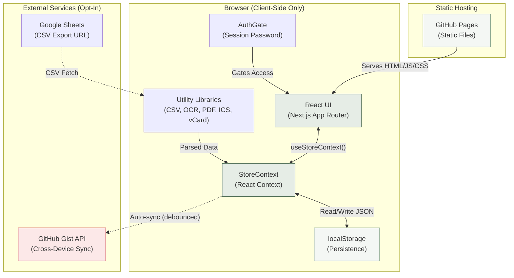
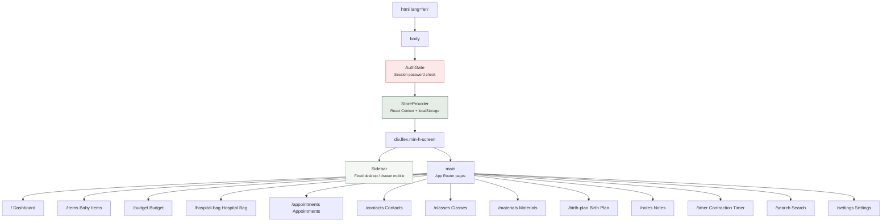
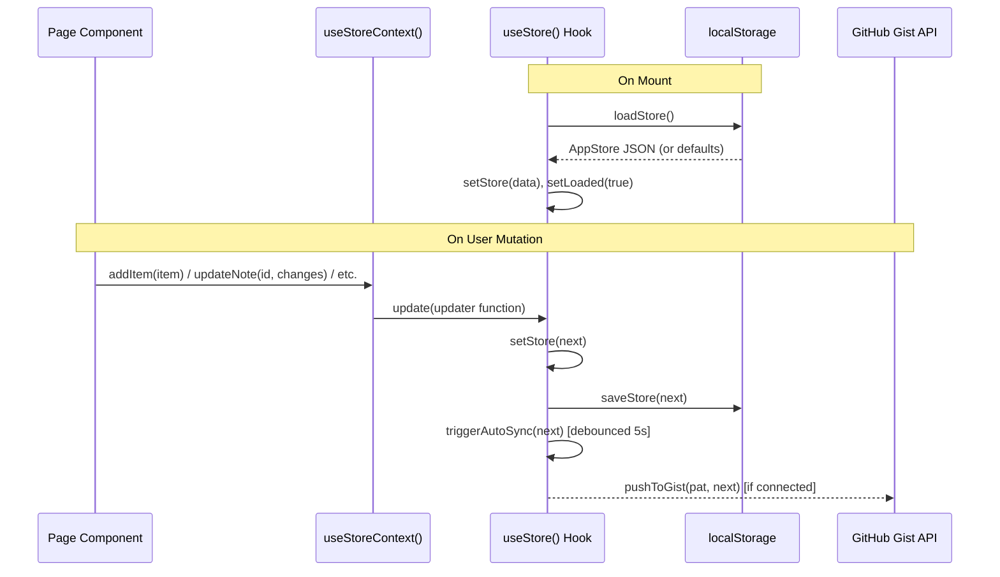
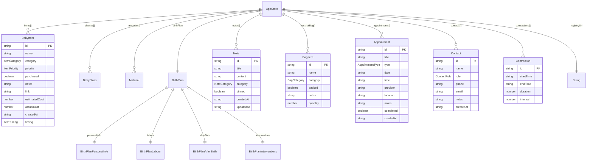
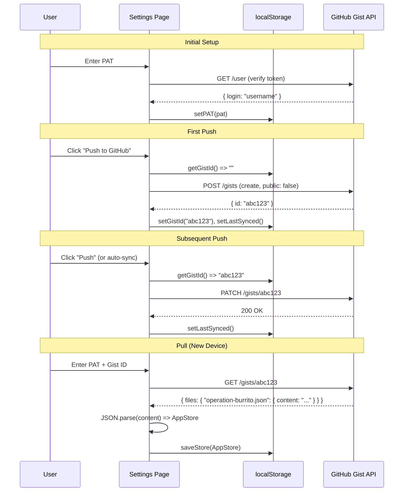
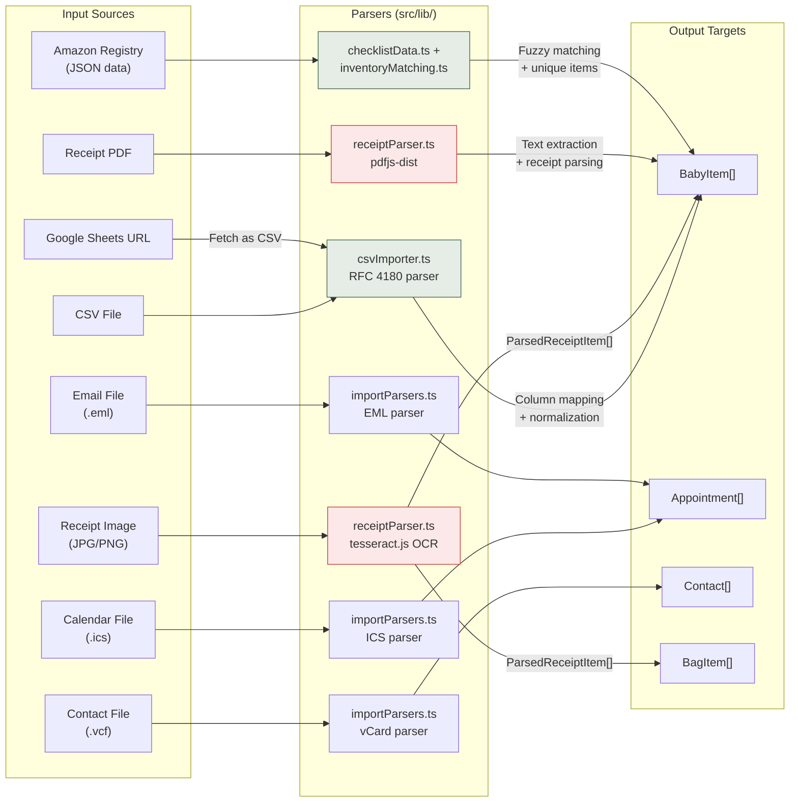

# Architecture Document -- Operation Burrito

**Version:** 0.1.0
**Last Updated:** 2026-04-21
**Status:** In Development

---

## 1. Architecture Overview

### Design Philosophy

Operation Burrito is a **client-only, privacy-first, zero-cost** baby preparation management application. Every architectural decision flows from three core constraints:

1. **No server** -- The entire application runs in the browser. There are no API routes, no database, no backend services.
2. **Privacy by default** -- All user data stays in localStorage. The only network call is opt-in GitHub Gist sync.
3. **Zero hosting cost** -- Static export deployed to GitHub Pages. No compute, no storage, no ongoing operational expense.

### High-Level System Diagram



---

## 2. Technology Stack

| Layer | Technology | Version | Rationale |
|-------|-----------|---------|-----------|
| **Framework** | Next.js (App Router) | 14.2.5 | File-based routing, static export support, modern React patterns. Used purely for routing and build tooling -- no SSR/SSG data fetching. |
| **UI Library** | React | ^18 | Component model, hooks-based state management, broad ecosystem. |
| **Language** | TypeScript (strict mode) | ^5 | Full type safety across the codebase. `strict: true` in tsconfig. |
| **Styling** | Tailwind CSS | ^3.4.1 | Utility-first CSS, rapid development, small production bundle via purging. |
| **Icons** | lucide-react | ^0.400.0 | Lightweight, tree-shakable icon set with consistent stroke styling. |
| **Class Utilities** | clsx | ^2.1.1 | Conditional className joining for Tailwind's conditional class patterns. |
| **PDF Parsing** | pdfjs-dist | ^5.6.205 | Client-side PDF text extraction for receipt scanning. Worker loaded from unpkg CDN. |
| **OCR** | tesseract.js | ^7.0.0 | Client-side optical character recognition for receipt image scanning. |
| **Linting** | ESLint + eslint-config-next | ^8 | Code quality enforcement with Next.js-specific rules. |
| **Build Tools** | PostCSS, Autoprefixer | ^8, ^10 | Required by Tailwind CSS processing pipeline. |

### Notable Absences

- **No state management library** (Redux, Zustand, Jotai) -- React Context is sufficient for this single-user app.
- **No UI component library** (shadcn, Radix, MUI) -- All components are hand-built with Tailwind.
- **No testing framework** -- No unit tests, integration tests, or E2E tests exist yet. This is a gap.
- **No service worker / PWA** -- Planned for a future release.
- **No analytics or telemetry** -- By design, for privacy.

---

## 3. Application Architecture

### Component Hierarchy



### Rendering Model

All pages use the `"use client"` directive. The Next.js static export (`output: "export"`) produces a fully pre-rendered set of HTML files with client-side JavaScript bundles. There is **no server-side rendering** and **no server components with data fetching**.

The rendering lifecycle:

1. **Static HTML** served from GitHub Pages (empty shell with JS bundles).
2. **AuthGate** mounts, checks `sessionStorage` for authentication flag. If not authenticated, renders password form.
3. **StoreProvider** mounts, calls `loadStore()` which reads `localStorage`. Sets `loaded = true`.
4. **Pages** render using store data via `useStoreContext()`.

### Routing

Next.js App Router provides file-based routing. All routes are client-side navigations after initial load.

| Route | Page | Purpose |
|-------|------|---------|
| `/` | `app/page.tsx` | Dashboard with countdown, stats, quick actions |
| `/items` | `app/items/page.tsx` | Baby items checklist and shopping tracker |
| `/budget` | `app/budget/page.tsx` | Budget analytics and spending breakdown |
| `/hospital-bag` | `app/hospital-bag/page.tsx` | Hospital bag packing checklist |
| `/appointments` | `app/appointments/page.tsx` | Appointment scheduling and tracking |
| `/contacts` | `app/contacts/page.tsx` | Important contacts directory |
| `/classes` | `app/classes/page.tsx` | Prenatal/parenting class tracking |
| `/materials` | `app/materials/page.tsx` | Educational resources library |
| `/birth-plan` | `app/birth-plan/page.tsx` | Comprehensive birth plan builder |
| `/notes` | `app/notes/page.tsx` | General notes with categories and pinning |
| `/timer` | `app/timer/page.tsx` | Contraction timer with 5-1-1 rule alert |
| `/search` | `app/search/page.tsx` | Global search across all data types |
| `/settings` | `app/settings/page.tsx` | GitHub sync config, registry URL, settings |

### Shared Components

| Component | File | Purpose |
|-----------|------|---------|
| `AuthGate` | `components/AuthGate.tsx` | Password-gated session authentication |
| `Sidebar` | `components/Sidebar.tsx` | Navigation (fixed desktop, drawer mobile) |
| `Modal` | `components/Modal.tsx` | Reusable modal dialog |
| `EmptyState` | `components/EmptyState.tsx` | Empty state placeholder |
| `BudgetChart` | `components/BudgetChart.tsx` | Budget visualization chart |
| `CsvImportModal` | `components/CsvImportModal.tsx` | CSV/Google Sheets import UI |
| `ReceiptImportModal` | `components/ReceiptImportModal.tsx` | Receipt OCR/PDF import UI |
| `IcsImportModal` | `components/IcsImportModal.tsx` | Calendar (ICS) file import |
| `VcardImportModal` | `components/VcardImportModal.tsx` | Contact (vCard) file import |

---

## 4. State Management

### Architecture

The app uses a single React Context (`StoreProvider`) that wraps the entire application tree. All state is managed through the `useStore()` custom hook in `src/hooks/useStore.ts`.

**Key design choices:**

- **Single source of truth:** One `AppStore` object holds all persisted state.
- **Synchronous persistence:** Every mutation immediately serializes the full store to `localStorage`.
- **Debounced auto-sync:** If GitHub Gist is connected, mutations trigger a 5-second debounced push to the Gist API.
- **Hydration guard:** The `loaded` flag prevents rendering stale default state before localStorage is read.

### Data Flow



### StoreContext API

The `useStoreContext()` hook exposes:

| Category | Methods |
|----------|---------|
| **Store** | `store`, `loaded`, `autoSyncing` |
| **Items** | `addItem`, `updateItem`, `deleteItem` |
| **Classes** | `addClass`, `updateClass`, `deleteClass` |
| **Materials** | `addMaterial`, `updateMaterial`, `deleteMaterial` |
| **Birth Plan** | `updateBirthPlan` |
| **Notes** | `addNote`, `updateNote`, `deleteNote` |
| **Hospital Bag** | `addBagItem`, `updateBagItem`, `deleteBagItem` |
| **Appointments** | `addAppointment`, `updateAppointment`, `deleteAppointment` |
| **Contacts** | `addContact`, `updateContact`, `deleteContact` |
| **Contractions** | `addContraction`, `clearContractions` |
| **Registry** | `updateRegistryUrl` |
| **Sync** | `loadFromExternal` |

All mutation methods are wrapped in `useCallback` and call the internal `update()` function, which: (1) applies the updater, (2) saves to localStorage, (3) triggers auto-sync.

### Persistence Strategy

- **Storage key:** `operation-burrito-store`
- **Format:** Full `AppStore` serialized as JSON
- **Read:** On component mount via `useEffect`
- **Write:** On every mutation, synchronously
- **Migration:** The `loadStore()` function handles missing fields by falling back to defaults. It also includes a guard against a legacy `birthPlan.sections` format.

---

## 5. Data Model

### AppStore Structure



### Key Design Properties

- **Flat entity collections:** All entities are stored as flat arrays on the root `AppStore`. There are no foreign key relationships between entities. Each collection is independent.
- **String UUIDs:** All `id` fields use `crypto.randomUUID()`.
- **ISO 8601 timestamps:** All date/time fields are ISO string format.
- **Single barrel types:** All TypeScript interfaces are defined in `src/types/index.ts`.
- **Union type enums:** Categories, priorities, and roles are TypeScript union types (not `enum`), ensuring exhaustive checking without runtime overhead.

### Static/Reference Data (Not Persisted)

The following data is loaded at build time from JSON files and TypeScript modules. It is **not** stored in `AppStore`:

| Data | Source | Purpose |
|------|--------|---------|
| `CHECKLIST_ITEMS` | `data/baby_checklist_metadata_v2.json` via `src/lib/checklistData.ts` | Pre-built checklist of ~100+ recommended baby items |
| `AMAZON_PURCHASED_ITEMS` | `data/baby_registry_items.json` via `src/lib/checklistData.ts` | Registry/inventory items for matching |
| `MATCHED_CHECKLIST_IDS` | Computed at module load | Set of checklist IDs that match owned inventory |
| `UNIQUE_INVENTORY_ITEMS` | Computed at module load | Registry items with no checklist match |

### Enumerations

All enumerations are TypeScript union string literal types:

| Type | Values |
|------|--------|
| `ItemCategory` | Nursery, Clothing, Feeding, Safety, Travel, Health & Hygiene, Toys & Gear, Postpartum, Other |
| `ItemPriority` | Must Have, Nice to Have, Optional |
| `ItemTiming` | Pregnancy, Hospital (Pre-birth), Newborn (0-3 months), 1-6 months, Special occasions, Other |
| `BagCategory` | Clothing -- Mom, Clothing -- Baby, Documents, Toiletries, Comfort & Labour, Feeding, Electronics, Snacks, Other |
| `AppointmentType` | OB / Midwife, Ultrasound, Blood Work, Hospital Tour, Dentist, Specialist, Other |
| `ContactRole` | OB / Doctor, Midwife, Doula, Hospital, Pediatrician, Partner, Family, Other |
| `ClassType` | Childbirth, Breastfeeding, Newborn Care, CPR / First Aid, Parenting, Prenatal Fitness, Other |
| `MaterialType` | PDF / Document, Video, Article, Book, App, Other |
| `NoteCategory` | Appointment, Milestone, Question for Doctor, Hospital Bag, Postpartum Plan, General |

---

## 6. Data Synchronization

### GitHub Gist Sync Architecture

Sync is **opt-in** and **manual** (with optional auto-sync after mutations). The app uses GitHub's Gist API to store a single JSON file containing the entire `AppStore`.



### Sync Configuration Storage

Sync credentials are stored in localStorage **separate** from the main store:

| Key | Value | Purpose |
|-----|-------|---------|
| `ob-github-pat` | GitHub Personal Access Token | Authentication for Gist API |
| `ob-gist-id` | Gist ID string | Identifies which Gist to read/write |
| `ob-last-synced` | ISO timestamp | Last successful sync time |

### Conflict Handling

**Current approach: Last-write-wins with full overwrite.**

- **Push** overwrites the entire Gist content with the current local state.
- **Pull** overwrites the entire local state with the Gist content.
- There is **no merge logic**. If Device A and Device B both make changes, whichever pushes last wins, and the other must pull (losing its local changes).

**Risk:** This is documented as a known limitation. A merge strategy is listed as a future enhancement.

### Auto-Sync Behavior

When a PAT and Gist ID are both present in localStorage, every store mutation triggers a **debounced auto-push** after 5 seconds of inactivity. This runs silently in the background (errors are swallowed).

---

## 7. Import Pipeline

### Overview

The app supports multiple import pathways, all running entirely client-side:



### CSV Import Pipeline (`src/lib/csvImporter.ts`)

1. **Parse:** RFC 4180-compliant CSV parser handles quoted fields, escaped quotes, and mixed line endings.
2. **Auto-map columns:** Header names are fuzzy-matched against known aliases (e.g., "product" maps to `name`, "price" maps to `estimatedCost`).
3. **Normalize values:** Category, priority, purchased status, and price are normalized from free-text to typed values.
4. **Google Sheets support:** Public Sheet URLs are converted to CSV export URLs (`/export?format=csv&gid=...`) and fetched client-side.

### Receipt Parsing Pipeline (`src/lib/receiptParser.ts`)

1. **Image files** are processed via `tesseract.js` (dynamically imported) for OCR text extraction.
2. **PDF files** are processed via `pdfjs-dist` (dynamically imported) for text content extraction. The PDF.js worker is loaded from the unpkg CDN.
3. **Text parsing** uses regex patterns to identify line items with prices, filtering out totals, tax lines, dates, phone numbers, and other non-item content.
4. **Output:** `ParsedReceiptItem[]` with name, price, and selection state for user review before import.

### File Import Pipeline (`src/lib/importParsers.ts`)

- **ICS (iCalendar):** Parses VEVENT blocks, extracts SUMMARY, DTSTART, LOCATION, DESCRIPTION. Handles timezone parameters and RFC 5545 line folding.
- **vCard:** Parses FN, N, TEL, EMAIL, ORG, TITLE fields. Handles multiple contacts per file.
- **EML (Email):** Splits headers from body, extracts From/Subject, strips HTML, decodes quoted-printable. Best-effort date/time extraction from body text.

### Inventory Matching (`src/lib/inventoryMatching.ts` + `src/lib/checklistData.ts`)

1. **Registry data** is loaded from `data/baby_registry_items.json` (Amazon registry + Google Sheet inventory).
2. **Checklist data** is loaded from `data/baby_checklist_metadata_v2.json` and deduplicated with name normalization.
3. **Matching** uses a manual mapping table (`INVENTORY_MATCHES`) plus normalized string comparison.
4. **Output:** `MATCHED_CHECKLIST_IDS` (items the user already owns) and `UNIQUE_INVENTORY_ITEMS` (owned items not in the checklist).

---

## 8. Deployment Architecture

### Static Export Configuration

```javascript
// next.config.js
const nextConfig = {
  output: "export",                           // Static HTML/JS/CSS export
  basePath: isProd ? "/Operation-burrito" : "",  // GitHub Pages subpath
  assetPrefix: isProd ? "/Operation-burrito/" : "", // Asset URL prefix
  images: { unoptimized: true },              // No image optimization server
};
```

### GitHub Pages Deployment

```
GitHub Repository
    |
    |--> Push to main branch
    |
    |--> GitHub Actions (CI/CD)
    |      |
    |      |--> npm install
    |      |--> npm run build (next build)
    |      |--> Deploy /out to GitHub Pages
    |
    |--> https://<username>.github.io/Operation-burrito/
```

**Build output:** The `next build` command with `output: "export"` produces a static `/out` directory containing:
- Pre-rendered HTML files for each route
- Client-side JavaScript bundles
- CSS files (Tailwind output)
- Static assets

### Base Path Handling

All internal links use Next.js `<Link>` which automatically prepends the `basePath` in production. The `assetPrefix` ensures JS/CSS bundles load from the correct subpath.

**Gap:** There is no `.github/workflows/` directory in the repository. CI/CD pipeline configuration is assumed but not yet implemented.

---

## 9. Security Considerations

### Authentication

The `AuthGate` component provides a simple client-side password gate:

- Password is checked against `process.env.NEXT_PUBLIC_APP_PASSWORD` (defaults to `"burrito"`).
- Authentication state is stored in `sessionStorage` (key: `ob-authed`), so it persists within a browser session but not across sessions.
- **This is NOT secure authentication.** The password is embedded in the client-side JavaScript bundle and visible to anyone who inspects the source. It serves as a casual access barrier, not a security boundary.

### GitHub PAT Security

| Concern | Current State | Risk Level |
|---------|--------------|------------|
| PAT storage | Stored in `localStorage` (key: `ob-github-pat`) | Medium -- accessible to any JS on the same origin |
| PAT scope | Expected to be `gist` scope only | Low -- minimal permissions even if compromised |
| PAT transmission | Only sent to `api.github.com` via HTTPS | Low |
| PAT exposure | Never sent to any third-party service | Low |

**Recommendations:**
- Consider IndexedDB with encryption for PAT storage in a future version.
- Add a prominent warning in the UI about the scope of the PAT.
- The default `"burrito"` password for AuthGate should be changed in production via the `NEXT_PUBLIC_APP_PASSWORD` environment variable.

### Data Privacy

- **All data in localStorage** -- no server-side persistence, no cookies (beyond browser defaults), no telemetry.
- **OCR and PDF parsing** run entirely client-side (tesseract.js, pdfjs-dist). No files are uploaded to any server.
- **Google Sheets import** fetches from Google's servers, which means Google can see the request (the sheet must be publicly shared). The fetched data stays client-side.
- **Gist sync** creates **secret (unlisted) Gists**, not public ones. However, anyone with the Gist URL can read it.

---

## 10. Performance Considerations

### Bundle Size

| Dependency | Approximate Size | Loading Strategy |
|-----------|-----------------|-----------------|
| React + React DOM | ~130 KB (gzipped) | Always loaded |
| Next.js runtime | ~80 KB (gzipped) | Always loaded |
| Tailwind CSS | ~10-30 KB (purged) | Always loaded |
| lucide-react | Tree-shakable; ~0.5 KB per icon | Always loaded (icons used) |
| tesseract.js | ~300 KB core + ~15 MB trained data | **Dynamic import** -- only loaded when receipt scanning is triggered |
| pdfjs-dist | ~500 KB + worker | **Dynamic import** -- only loaded when PDF parsing is triggered |
| clsx | ~0.5 KB | Always loaded |

**Current strength:** Both `tesseract.js` and `pdfjs-dist` use dynamic `import()` in `receiptParser.ts`, which means they are code-split and only fetched when the user initiates receipt scanning. This is a good pattern.

### localStorage Limits

- **Typical browser limit:** 5-10 MB per origin.
- **Expected usage:** Text-only data (no images/blobs). A fully-loaded store with hundreds of items, notes, and a complete birth plan is estimated at 50-200 KB -- well within limits.
- **Risk:** No monitoring or warning for approaching storage limits. If a user imports very large CSV files repeatedly without cleanup, they could theoretically approach limits.

### Lazy Loading Opportunities

| Opportunity | Current State | Impact |
|------------|--------------|--------|
| Page-level code splitting | Automatic via Next.js App Router | Already optimized |
| Receipt/OCR libraries | Dynamic import | Already optimized |
| Checklist metadata JSON | Imported at build time, included in JS bundle | Medium -- could be loaded on demand |
| Registry data JSON | Imported at build time, included in JS bundle | Medium -- could be loaded on demand |
| Chart components | Loaded with budget page | Low impact |

### Rendering Performance

- **Full store serialization on every mutation** -- This is simple but O(n) where n is the total data size. For the expected data volumes (hundreds of items, not thousands), this is not a concern.
- **No virtualization** -- Lists render all items. For checklists with 100+ items, this could cause jank on low-end mobile devices. Consider `react-window` or similar if performance issues arise.
- **No `useMemo` for expensive computations** -- Some pages compute filtered/grouped views on every render. The `useMemo` hook is used in some places (after the hooks-before-return fix in commit 7e72c84), but not consistently.

---

## 11. Technical Decisions and Trade-offs

### ADR-001: Client-Only Architecture (No Backend)

**Decision:** Build the entire application as a static client-side app with no backend.

**Context:** The app handles sensitive personal and medical data (birth plans, medical conditions, appointments). A server would introduce data custody obligations, hosting costs, and authentication complexity.

**Consequences:**
- (+) Zero hosting cost, zero operational burden.
- (+) Complete user data ownership -- data never leaves the device unless explicitly synced.
- (+) Works fully offline (except sync).
- (-) No real-time collaboration between devices.
- (-) Data loss risk if user clears browser data without syncing.
- (-) No server-side search, notifications, or background processing.

### ADR-002: localStorage as Primary Persistence

**Decision:** Use `localStorage` for all data persistence.

**Context:** IndexedDB offers more storage and better structure, but localStorage is simpler, synchronous, and sufficient for the expected data volumes.

**Consequences:**
- (+) Simple synchronous read/write API.
- (+) No async complexity for data access.
- (-) ~5-10 MB limit per origin.
- (-) Synchronous writes block the main thread (negligible for current data sizes).
- (-) No structured queries -- entire store must be deserialized for any read.

### ADR-003: Full Store Overwrite for Sync

**Decision:** Sync pushes/pulls the entire `AppStore` as a single JSON blob, overwriting completely.

**Context:** Implementing merge logic (CRDT, OT, or even field-level diffing) adds significant complexity for a use case that is primarily single-user or asynchronous two-user.

**Consequences:**
- (+) Extremely simple sync implementation (~100 lines).
- (+) Deterministic -- no merge conflicts, no partial states.
- (-) No offline merge -- if both devices make changes, one set is lost on pull.
- (-) Bandwidth inefficient for large stores (sends everything on every sync).

### ADR-004: React Context over External State Library

**Decision:** Use React Context + `useReducer`-style hook instead of Redux, Zustand, or similar.

**Context:** The app is single-user with a simple CRUD data model. The overhead of an external state library is not justified.

**Consequences:**
- (+) Zero additional dependencies.
- (+) Familiar React patterns.
- (-) All consumers re-render on any store change (no selector-based optimization).
- (-) No devtools for state inspection (Redux DevTools, etc.).

### ADR-005: Static Reference Data in JS Bundle

**Decision:** Checklist metadata and registry data are imported as JSON at build time and included in the JavaScript bundle.

**Context:** These are reference datasets that do not change at runtime. Loading them at build time avoids async loading states.

**Consequences:**
- (+) Instant access to reference data, no loading states.
- (+) Works offline.
- (-) Increases initial JS bundle size (the JSON data is embedded in the bundle).
- (-) Updating reference data requires a rebuild and redeploy.

### ADR-006: Client-Side Password Gate (AuthGate)

**Decision:** Use a simple client-side password check (`NEXT_PUBLIC_APP_PASSWORD`) as a casual access barrier.

**Context:** The app is deployed to a public GitHub Pages URL. A minimal barrier prevents casual access but does not provide true security.

**Consequences:**
- (+) Simple implementation, no auth service required.
- (+) Password configurable via environment variable.
- (-) Password is visible in the client-side JS bundle. Anyone who inspects source can bypass it.
- (-) Not suitable for protecting genuinely sensitive deployments.

---

## 12. Identified Gaps and Recommendations

### High Priority

| Gap | Description | Recommendation |
|-----|-------------|----------------|
| **No CI/CD pipeline** | No `.github/workflows/` directory exists. Deployment process is unclear. | Add a GitHub Actions workflow for build + deploy to GitHub Pages. |
| **No tests** | No test files, no test framework configured. | Add at minimum: unit tests for utility libraries (csvImporter, receiptParser, inventoryMatching), component tests for critical flows. |
| **No error boundaries** | A runtime error in any component could crash the entire app. | Add React Error Boundaries around major page sections. |

### Medium Priority

| Gap | Description | Recommendation |
|-----|-------------|----------------|
| **Context re-render performance** | Every store mutation triggers re-render of all consuming components. | Consider splitting context into per-domain contexts or adopting Zustand with selectors if performance issues emerge. |
| **No data export** | Users can sync to Gist but cannot export data as CSV/JSON from the UI. | Add export functionality for data portability. |
| **No store size monitoring** | No warning when localStorage approaches capacity limits. | Add a size check after writes and display a warning in settings. |
| **pdfjs-dist worker from CDN** | The PDF.js worker is loaded from unpkg.com, creating an external runtime dependency. | Bundle the worker locally or use a self-hosted copy. |
| **Default birth plan data** | The default birth plan includes personal data (partner name, medical conditions). | Move personal defaults to a separate, non-committed config file. |

### Low Priority

| Gap | Description | Recommendation |
|-----|-------------|----------------|
| **No PWA / service worker** | App does not work offline after initial load if cache is cleared. | Implement service worker for offline-first capability. |
| **No dark mode** | Only light theme is available. | Add dark mode support via Tailwind's `dark:` variant. |
| **No accessibility audit** | WCAG compliance has not been verified. | Run axe/Lighthouse accessibility audits and address findings. |
